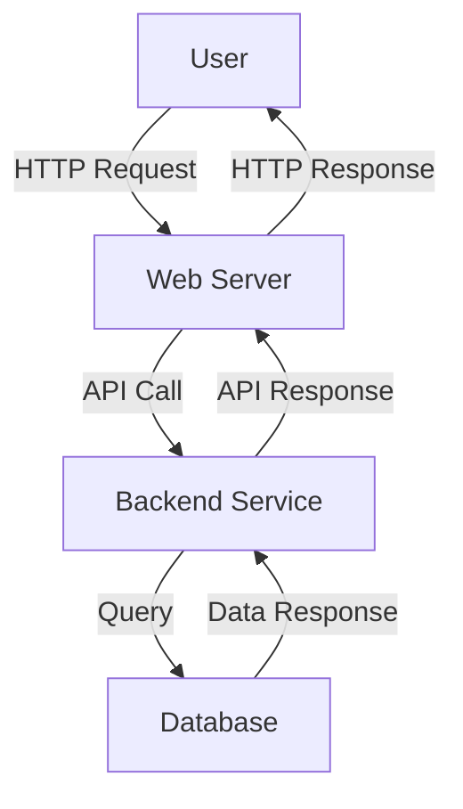

# High-Level Diagram of Web Application

## Components

- **User**: The end user interacting with the web application through a browser.
- **Web Server**: Handles HTTP requests from the user and forwards them to the backend service.
- **Backend Service**: Processes business logic, interacts with the database, and returns data to the web server.
- **Database**: Stores and retrieves application data.

## Data Flow

1. The user sends an HTTP request to the web server.
2. The web server forwards the request to the backend service.
3. The backend service queries the database.
4. The database returns the requested data to the backend service.
5. The backend service sends the data back to the web server.
6. The web server responds to the user with the requested information.
